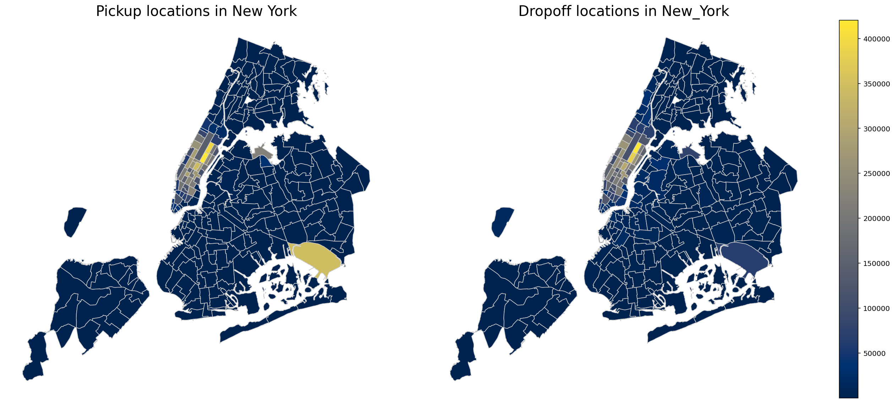

# Analyze NYC Yellow Taxi Trip Data

This was a graded mini-project for the Database Technology class in the 4th semester.
The goal was to learn the procedure for a Data Science project:
- Where do I get da data set?
- Validation of the data
- What can I do with the data?
- Analysis
- Evaluation and ciritval view of the analysis

Specifications:
- At least 1000 rows
- Not more then 1 GB
- Create a document with the findings (3-4 pages)
